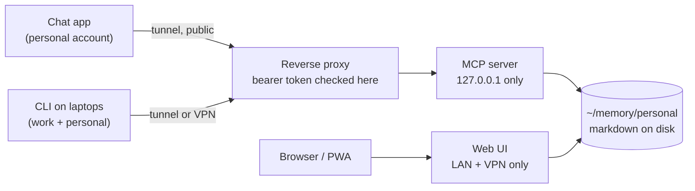

I regularly talk with AIs to explore new ideas and try to solve problems, and chats like Claude keep
a good amount of knowledge about you, but there are some downsides to it, like: it will have stale
memories about decisions, it's hard to know what is in the memory and what is not, you don't have a
good way to organize it, and it's not your memories... it is the vendor's memories about you.

I wanted to have more control over my own memories, and also to keep notes in a better way.

## How I solved this

Short answer: a markdown vault, which in my case was SilverBullet and the memory MCP on top of it.

This gave me what I wanted. A place where I could add notes to an inbox. Every thought I have that
has nowhere to go now has somewhere.

When I talk to Claude in a chat and I want to save something as a decision, an idea or anything
else, I ask it to do so. If I move from Claude to OpenAI I can do it easily, as my memories are not
tied to Claude anymore.

## The shape matters more than the parts

The tools matter less than the shape, and the shape is three things:

- A store you host. Plain markdown in a directory, files you can `cat` and grep when everything else
  is broken.
- A protocol any client speaks, which is MCP. Anything that talks MCP can read and write the store,
  and that is what survives you changing assistant.
- Auth in front of it, because it has to be reachable from outside my network.

I run [Basic Memory](https://github.com/basicmachines-co/basic-memory) for the MCP side and
[SilverBullet](https://silverbullet.md) for the human side, two containers over one directory, but
you don't need two pieces.
[silverbullet-mcp](https://github.com/Ahmad-A0/silverbullet-mcp) puts an MCP server in front of
SilverBullet itself, and [MCP Connector](https://community.obsidian.md/plugins/mcp-tools-istefox)
does the same for an Obsidian vault. Pick whatever you like, if the tool dies tomorrow the markdown
is still markdown.

## Why SilverBullet?

It's a web interface, so I host it inside my Tailscale and open it from any device without
installing anything. And because there is one copy on one server, I don't have to deal with file
conflicts between devices, or figure out how to sync them in the first place. That's what always got
me with Obsidian: I'd either pay for their sync or wire up my own, and I didn't want to do either.

## The build

Two containers over one directory:

The MCP server holds the notes and talks to the assistants. The web UI is there so I can read and
edit notes without opening a chat, and that mattered more than I expected, because I don't tidy a
store that I can only reach by talking to a robot.

The important bit is that the web UI's space is the MCP server's project directory. Same path, both
containers. That's what makes it one store and not two stores syncing.

The MCP server binds to loopback, so the reverse proxy in front is the only place the token gets
checked. It has to be public because the phone app's tool calls don't come from the phone, they come
from the vendor's servers, and a private address can't serve those. So one endpoint faces the
internet and the token is the whole perimeter. The web UI only serves devices I own, so it stays
private.

## My weekly process

The inbox would rot if nobody ever looked at it, so I have a scheduled task that sweeps the store
every Monday. It reads the conventions the store documents about itself, so it isn't making up
filing rules of its own. It does the mechanical stuff by itself: a closed task moves to the archive
with a line on what actually closed it, pulled from `git log`. Everything else becomes a question
instead of a guess. It never moves or deletes a capture, it just proposes a home. What I get on
Monday is a short list of questions to answer.

That's the part that makes this work for me. I'm not filing anything while I write, I do it once a
week in a batch with the boring half already done.

## Where specs live now

Specs used to go into a `docs/` folder in whatever repo I had open. Now a design document is filed
by subject and gets archived when it's done. The one for the migration that rebuilt this site was
written into the store and then amended three times across separate sessions as decisions changed,
including one reversal with the reason it was reversed. So I have a record of how the thinking
moved, and a chat transcript doesn't give me that.

## What it costs

It's single-player. A shared store needs a real authorisation model and mine is one token that
grants everything.

It's one host. If that box is down there's no capture from the phone and I'm back to pasting into a
chat.

The token is the whole perimeter. No IP allowlist, no second factor.

I often don't know where a note is. I traded filing for search, and for the thing doing the filing
staying consistent.

---

If you only use one tool its built-in memory is probably fine and it'll keep getting better, but I
use more than one and I didn't want to depend on any of them to remember things for me.
