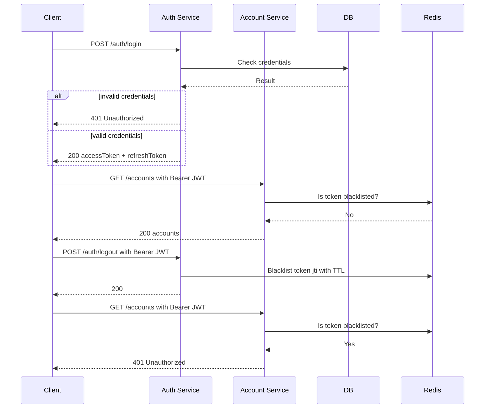

# Pragmatic Haskell: Building a Microservice Template That Actually Does Things

I've been working with Haskell for the last 4 years at __NoRedink__ and for those
years I find myself happy working with the language as it gives a
powerful type system that helps me build code that (almost) doesn't break.

But there is one thing: when it comes to personal projects I had no idea on
how to start a new Haskell service from scratch. There was a lot of boilerplate
to write. At my job things are pretty straightforward as we have libraries
that accelerate our development process, and I wanted something similar! So I
had an idea: why not build my own common libraries for services?

So I built it.

## The idea

I started with a list of what I wanted to build:

- *Component system*. I wanted stateful components to be initialized at startup,
wired together explicitly, and allow them to be easily mocked on tests.
- *Tracing*. Correlation IDs that are logged from when a process starts
to all its side effects on every service it touches.
- *Http server*. To expose APIs with type-safe routing.
- *Auth*. JWT-based, with scopes baked into the type system and allow services to
check scopes without external dependencies.
- *Event system*. Services shouldn't call each other over HTTP as it will decrease
overall system availability. Kafka keeps services decoupled and lets them evolve
independently.
- *Database*. Handle connection pooling, migration, repository pattern so we can
keep SQL out of our domain logic.

## Reader over IO (RIO)

There are a lot of ways you can handle IO in Haskell: effect system, stack monad
transformers, tagless final, etc. But the one I really enjoy working with is
RIO. RIO is reader monad (which allows you to read some state on an env),  that
also allows you to perform IO.

You might be thinking what this means exactly? Well glad you asked.
The state that a reader will have on the environment will be the stateful
components of your system, such as databases, queues, http and other things
that interact with the external world. While the IO will enable you to
perform side effects.

One example of App state is:

```haskell
data App = App
  { appLogFunc     :: !LogFunc
  , appDbPool      :: !ConnectionPool
  , appCorrelation :: !CorrelationId
  , ...
  }
```

With that we can declare some typeclass to check if the env contains a
component:

```haskell
class HasCorrelationId env where
  correlationIdL :: Lens' env CorrelationId
```

When using a function that needs a component you declare on the type signature
the needed typeclasses that the env needs to conform.

```haskell
-- You know exactly what this function needs
listAccounts :: (HasLogFunc env, HasDB env, HasCorrelationId env) => RIO env [Account]
```

## Tracing

Logs is one of the most useful ways to debug what is happening to your services
in production. With distributed system it's hard to know what happens in each
part of the processing. Multiple services can handle the same Kafka message and
sometimes it's hard to follow.

With this problem in mind I find it useful to create correlation ids
which appends a new segment every interaction with a different service. To
do that I made two small functions to generate CIDs.

```haskell
generateCorrelationId :: (MonadIO m) => m CorrelationId
generateCorrelationId = liftIO $ do
  let chars = "abcdefghijklmnopqrstuvwxyz0123456789"
      charsList = T.unpack chars
  ids <- replicateM 6 $ do
    idx <- randomRIO (0, length charsList - 1)
    return (charsList !! idx)
  return $ CorrelationId $ T.pack ids

appendCorrelationId :: (MonadIO m) => CorrelationId -> m CorrelationId
appendCorrelationId (CorrelationId existingCid) = do
  newSegment <- generateCorrelationId
  return $ CorrelationId $ existingCid <> "." <> unCorrelationId newSegment

```

So correlation ids are logged in every service interaction I also added to the
log context on the environment. Note that `HasLogContext` is where CID is saved.

```haskell
formatContext :: Map Text Text -> Utf8Builder
formatContext ctx
  | Map.null ctx = mempty
  | otherwise = "[" <> mconcat (map formatEntry (Map.toList ctx)) <> "] "
  where
    formatEntry (key, value) = fromString (T.unpack key) <> "=" <> fromString (T.unpack value) <> " "

logInfoC :: (HasCallStack, HasLogFunc env, HasLogContext env, MonadReader env m, MonadIO m) => Utf8Builder -> m ()
logInfoC msg = withFrozenCallStack $ do
  ctx <- view logContextL
  logInfo $ formatContext ctx <> msg
```

This produces a good pattern for logs as shown:

```
[cid=abc123.xyz789 ] --> POST /register
[cid=abc123.xyz789 ] Register request for: user@example.com
[cid=abc123.xyz789 ] Issued token pair for user: 42
[cid=abc123.xyz789 ] <-- 201 (12ms)

# account-service — same CID carried through Kafka headers:
[cid=abc123.xyz789.mn4kp1 ] user-registered consumed
[cid=abc123.xyz789.mn4kp1 ] Created account for user 42

# notification-service — same root CID again:
[cid=abc123.xyz789.mn4kp1.qq9r2x ] Notification dispatched to user@example.com
```

## HTTP

On HTTP server I chose servant as a library to handle requests. Servant provided
type safety on all endpoints and on the route declaration, context and auth middleware.

On servant I wanted to have transparent access to RIO monad on handler, so I could
easily declare a route and have all the stateful components on the handler side
as such:

```haskell
    getAccountById ::
      route
        :- Summary "Get account by ID"
          :> "accounts"
          :> JWTAuth
          :> Capture "id" Int64
          :> Get '[JSON] Account,

type Domain env = (HasLogFunc env, HasLogContext env, HasDB env, HasCorrelationId env)

getAccountById :: Domain env => Int64 -> AccessTokenClaims -> RIO env Account
getAccount accId claims = do
  logInfoC $ "Getting account: " <> displayShow accId
  mAccount <- Repo.findAccountById accId
  case mAccount of
    Nothing -> throwM err404 {errBody = "Account not found"}
    Just account -> do
      authorize claims account
      return account
```

Note that we are always passing log context on the requests, but where is the cid
being generated?

It's been generated by a servant middleware that intercepts every request and make
sure that the log context is being properly populated. It first tries to get the
current cid if exists, and if it does append a new segment, otherwise just generate
a new one:

```haskell
correlationIdMiddleware :: Middleware
correlationIdMiddleware app req respond = do
  let maybeHeaderCid = lookup "X-Correlation-Id" (requestHeaders req)

  baseCid <- case maybeHeaderCid of
    Just headerVal
      | not (BS.null headerVal) ->
          return $ CorrelationId $ TE.decodeUtf8 headerVal
    _ ->
      generateCorrelationId

  cid <- appendCorrelationId baseCid

  let req' = req {Wai.vault = Vault.insert correlationIdKey cid (Wai.vault req)}

  app req' $ \response -> do
    let cidHeader = ("X-Correlation-Id", TE.encodeUtf8 $ unCorrelationId cid)
    let response' = Wai.mapResponseHeaders (cidHeader :) response
    respond response'
```

## Auth

Note that the previous function also dealing with some JWT based authorization
here:

```haskell
      authorize claims account
```

This function comes from common auth library that is defined as such:

```haskell
authorize :: (AccessPolicy r, MonadIO m, MonadThrow m) => AccessTokenClaims -> r -> m ()
authorize claims resource =
  unless (canAccess claims resource) $
    throwM err403 {errBody = "Forbidden"}
```

So the domain entity needs to implement `AccessPolicy` to know what scopes/identity
the jwt needs to access a particular entity. This is an example were only admins
and account owners can access an entity:

```haskell
instance AccessPolicy Account where
  canAccess claims account =
    "admin" `elem` atcScopes claims
      || ( "read:accounts:own" `elem` atcScopes claims
             && "user-" <> pack (show (accountAuthUserId account)) == atcSubject claims
         )
```

As the token has all the information the service needs there is no dependency on
the auth service to perform this check.

There is a default auth service on the template with a default auth flow, which
works as the following:



This is simple enough for our case and integrates well with Servant.

## Event system

To increase overall availability on a distributed architecture async processing
is recommended. If one service is unavailable when another service sends a message
it won't affect the availability of the other service and the message will be eventually
processed.

For this I chose Kafka. I wanted to have the same ergonomics as HTTP requests.
Have CIDs on every message handled and propagate CIDs when needed. I won't show
details as it's very similar with the HTTP approach, but here is an example of
how a consumer works:

```haskell
notificationsTopic :: TopicName
notificationsTopic = TopicName "notifications"

-- | Build the Kafka consumer configuration.
-- The consumer loop automatically sends failing messages to the dead-letter
-- topic after 'maxRetries' attempts — handlers only need to throw on error.
consumerConfig ::
  (Domain env, HasMetrics env) =>
  Settings ->
  ConsumerConfig env
consumerConfig kafkaSettings =
  ConsumerConfig
    { brokerAddress = kafkaBroker kafkaSettings,
      groupId = kafkaGroupId kafkaSettings,
      topicHandlers =
        [ TopicHandler
            { topic = notificationsTopic,
              handler = notificationHandler
            }
        ],
      deadLetterTopic = TopicName (kafkaDeadLetterTopic kafkaSettings),
      maxRetries = kafkaMaxRetries kafkaSettings,
      consumerRecordMessageMetrics = recordKafkaMetricsInternal,
      consumerRecordOffsetMetrics = recordKafkaOffsetMetricsInternal
    }

-- | Parse and dispatch a notification message.
-- Throws (→ dead letter) if the payload cannot be decoded as JSON.
notificationHandler ::
  Domain env =>
  Value ->
  RIO env ()
notificationHandler jsonValue =
  case Aeson.fromJSON @NotificationMessage jsonValue of
    Aeson.Error err -> do
      let msg = "Failed to parse notification message: " <> err
      logErrorC (fromString msg)
      throwString msg
    Aeson.Success msg -> processNotification msg
```

On topic handlers we declare which topics the service is consuming and the handler.
The handler also has access to the env using the RIO monad and process the message.
In case of failure processing the message after a set number of retries, the message
is sent to a DLQ topic, which is consumed by the DLQ service.

The DLQ service is a very simple service which will save the whole message details
to a database, which will be available to a UI so a developer can check the message
for debug and choose if the message should be reprocessed or dropped.

## Database

On the database side it uses `persistant` to handle SQL entities. This is a simple
ORM style so we don't need to handle SQL manually, but I wanted to have some special
tooling for debug. One thing I find useful is to know which correlation id performed
an action so we can easily find the logs related to that entity.

```haskell
share
  [mkPersist sqlSettings, mkMigrate "migrateAll"]
  [persistWithMeta|
SentNotification
  templateName Text
  channelType  Text
  recipient    Text
  content      Text
  deriving Show
  |]
```

This is an entity declaration for SendNotification on the notification service.
Note that this uses `persistWithMeta`. The implementation for this is a little trick,
but in summary, this will add cid to the SQL table that is created with
it and when saving it will get the information from the current env and save the
CID metadata when saving.

## Misc

Some topics that I won't cover here in details, but were thought during development:

### Architecture: ports-and-adapters

All services follow the same structure, organized around the domain:

```sh
❯ tree
...
├── src
│   ├── App.hs
│   ├── DB
│   │   └── Account.hs
│   ├── Domain
│   │   └── Accounts.hs
│   ├── Lib.hs
│   ├── Ports
│   │   ├── Consumer.hs
│   │   ├── HttpClient.hs
│   │   ├── Produce.hs
│   │   ├── Repository.hs
│   │   └── Server.hs
│   ├── Settings.hs
│   └── Types
│       ├── In
│       │   └── UserRegistered.hs
│       └── Out
│           ├── AccountCreated.hs
│           └── Notifications.hs
└── test
    └── Spec.hs
```

`Domain` is where the usecases live. `Ports` is where interactions with the
external world live — the usecase calls them using domain model entities and the
ports adapt them to external HTTP requests, Kafka messages, etc. `Types` is where
we declare records used to communicate with other services. `DB` is where we
declare database entities using the `persistent` library. `Settings` is where
configuration lives — HTTP, Kafka, etc.

One example is:

```haskell
getAccount :: Domain env => Int64 -> AccessTokenClaims -> RIO env Account
getAccount accId claims = do
  logInfoC $ "Getting account: " <> displayShow accId
  mAccount <- Repo.findAccountById accId
  case mAccount of
    Nothing -> throwM err404 {errBody = "Account not found"}
    Just account -> do
      authorize claims account
      return account
```

Via `Repo.findAccountById`, the domain delegates the DB query to the repository
port, which handles the SQL query. The domain doesn't need to care about
implementation details of the database, which are encapsulated by:

```haskell
findAccountById :: Repo env => Int64 -> RIO env (Maybe Account)
findAccountById accId = do
  pool <- view dbL
  runSqlPoolWithCid (get (toSqlKey accId :: AccountId)) pool
```

### Monitoring

I set up Grafana/Loki/Prometheus to have service metrics and logs visualization,
this makes it easy to debug any problems I could have on production.

One of the most useful dashboards I made was the CID investigator, which is a query
that lets you trace every part of a request since the initial call.

### Testing

RIO pattern allows you to mock every component of the APP, so if your function
depends on a `HasDB env`, you can build an APP that implements this and test your
function.

Every service follows the same pattern to create a test app, which mocks
external component dependencies:
```haskell
withTestApp :: (Int -> TestApp -> IO ()) -> IO ()
withTestApp action = do
...
  let testApp =
          TestApp
            { testAppLogFunc = logFunc,
              testAppLogContext = Map.empty,
              testAppSettings = testSettings,
              testAppCorrelationId = defaultCorrelationId,
              testAppDb = pool,
              testAppMockKafka = mockKafkaState,
              testAppHttpClient = httpClient,
              testAppMockHttp = mockHttpState,
              testAppMetrics = metrics
            }

    liftIO $ testWithApplication (pure $ testAppToWai testApp) $ \port' -> action port' testApp
```

With that we are able to make some tests like this http test:

```haskell
it "respond with 200 on status" $ do
  withTestApp $ \port' _ -> do
    manager <- newManager defaultManagerSettings
    request <- parseRequest (baseUrl port' <> "/status")
    response <- httpLbs request manager
    responseStatus response `shouldBe` status200
    responseBody response `shouldBe` "\"OK\""
```

Since `withTestApp` populates the `testApp`, it can also produce Kafka messages, for example:

```haskell
setupAccount :: TestApp -> Int64 -> Text -> IO ()
setupAccount testApp uid email = runRIO testApp $ do
  let mockKafka = testAppMockKafka testApp
      event = UserRegisteredEvent {userId = uid, email = email}
      consumerCfg = KafkaPort.consumerConfig (Settings.kafka (testAppSettings testApp))
  mockProduceMessage (MockProducer mockKafka) (TopicName "user-registered") Nothing event
  processAllMessages (MockConsumer mockKafka) consumerCfg
...
it "creates account automatically on user-registered Kafka event" $ do
  withTestApp $ \port' testApp -> do
    setupAccount testApp 42 "eve@example.com"

    -- Account is the first inserted row so its DB primary key is 1.
    -- The bearer token carries the auth user ID (42), which must match account.authUserId.
    manager <- newManager defaultManagerSettings
    req <- parseRequest (baseUrl port' <> "/accounts/1")
    resp <-
      httpLbs
        req {requestHeaders = [("Authorization", "Bearer token-user-42")]}
        manager
    statusCode (responseStatus resp) `shouldBe` 200
```

### Admin UI

I also built a small react UI to have some admin capabilities.

It has:
- login, so only admins can access it.
- Deadletter queue management, so I can inspect and replay messages that failed during async processing.
- Notifications that got sent to other users.

## How was the experience so far?

Building this tooling was very satisfying for myself. I find that Haskell has
a unique superpower: it gives you confidence on the type system so you know that
what you built is probably going to work.

Sadly, Haskell tooling is limited, library options are limited and some type
errors are hard to figure out. Have that in mind if you want to explore Haskell.

I am also sharing the code of this adventure as a reference, this is not a production
ready code as it was mostly a fun project, but there is a lot to learn from this.

*Code: [github.com/arthurjordao/haskell-service-template](https://github.com/arthurjordao/haskell-service-template)*
