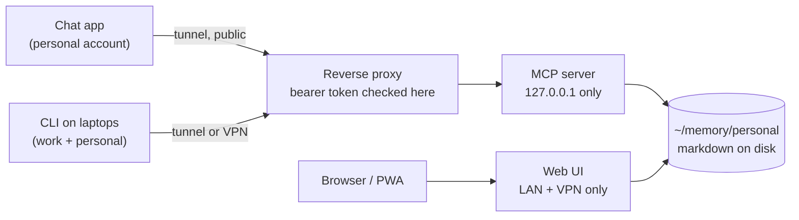

I use more than one AI assistant, with more than one account. There is a chat app on my phone
signed into my personal account, and a CLI on two laptops, one of which is signed into work. That
is a completely ordinary setup in 2026, and it has a completely ordinary consequence: an idea I
worked out on the phone on a Sunday is not there on Monday when I open the terminal.

So I retyped things. Not files, not projects — the *thinking*. The three paragraphs of context that
explain why a decision was made the way it was, pasted again into a fresh conversation, slightly
worse each time because I was reconstructing it from memory instead of reading it.

That retyping is the problem I set out to remove. Not syncing files between machines, which is a
solved problem, and not per-project memory, which every tool now ships. The thing that has no
answer is context that has to survive a change of tool, a change of account, and a change of
machine.

## Why no product is going to fix this

The obvious move is to wait. Every vendor is shipping memory, and it gets better every few months.
I do not think waiting works here, and the reason is structural rather than technical.

**No vendor has an incentive to make your memory legible to a competitor.** Memory is retention. A
store that any client could read is a store you could leave with, and nobody builds that on
purpose.

And even inside one vendor, there is the account boundary. My work account and my personal account
are administered by different people under different policies, and that separation is *correct* —
I do not want them merged. But it means the vendor's own memory feature, however good it gets, is
scoped to one side of a line I need to cross.

Those two facts do not describe a gap in a roadmap. They describe something the market structure
prevents from existing. If your context has to cross a competitor or an account, you host it or you
do without it.

## The shape matters more than the parts

Before naming any tool, here is the whole design:

- **A store you host.** Plain markdown in a directory. Not a database, not a service's internal
  format — files I can read with `cat` and grep when everything else is broken.
- **A protocol any client speaks.** The store exposes itself over MCP, so anything that talks MCP
  can read and write it. That is what makes it survive a change of assistant.
- **Auth in front of it.** Because it has to be reachable from outside my network, which turns out
  to be the part people get wrong.

Every specific choice below is replaceable. If the server I use is abandoned tomorrow, the markdown
is still markdown and the shape is unchanged. **That is the actual load-bearing idea, and it is why
this is worth doing rather than waiting.**

## The build

Two containers, one directory:



The MCP server holds the notes and speaks to the assistants. The web UI is so I can read and edit
the notes without opening a chat — which matters more than I expected, because a store you can only
reach by talking to a robot is a store you will not tidy.

**The web UI's space is the MCP server's project directory.** Same path, both containers. That one
decision is what makes the two halves the same store instead of two stores that sync. It also means
the UI's own scratch pages get indexed, which is what you want.

One environment variable earns its own sentence: the MCP server has a flag that makes it watch the
filesystem for changes. Without it, the index only reflects what the MCP tools themselves wrote, so
anything I typed in the web UI would be invisible to the assistants. With it, an edit in the browser
is a fact the CLI knows about seconds later.

### The auth, and the trap in it

The MCP server binds to loopback only. Nothing reaches it except the reverse proxy, which is
therefore the only place a token needs checking:

```nginx
notes.example.com {
    @unauth not header Authorization "Bearer {$NOTES_TOKEN}"
    respond @unauth 401
    reverse_proxy 127.0.0.1:8086
}
```

Here is the part that cost me an evening. Caddy has two placeholder syntaxes and they are not
interchangeable. `{$VAR}` is a textual substitution performed *before* the config is parsed, so it
works anywhere, including inside a matcher. `{env.VAR}` is resolved at runtime, and a config field
only honours it if that module was written to expand it — the `header` matcher was not. Use the
runtime form here and you get a guard that silently matches nothing, which is the worst possible
failure for an auth check: it looks configured and it is open.

**Why it is public at all**, given that every machine I own is on a VPN: the phone app's tool calls
do not originate from the phone. They come from the vendor's servers. A private address cannot serve
those, so this one endpoint is exposed to the internet and the token is the entire perimeter. The
web UI, which only ever needs to serve devices I own, stays private. That asymmetry is deliberate —
it is worth being clear about which half of your own infrastructure actually needs to be reachable.

## The part I did not plan

I built this to stop retyping context. What I actually got was a place for design decisions to
live.

Specs used to go into a `docs/` directory of whatever repository happened to be open. That is wrong
twice over: the decision usually outlives the repository, and it often spans several. Worse, on this
machine that path is git-ignored globally, so I was writing documents to a location that could never
be committed and then wondering where they went.

Now they land somewhere addressed by *subject* instead of by whichever repo I had open, and they get
archived rather than scrolled past. The design document for the migration that rebuilt this very
site was written into the store, then amended three times across separate sessions as decisions
changed — including one reversal, recorded with the reason it was reversed. None of that survives in
a chat transcript.

That turned out to be worth more than the memory.

## The other thing I did not plan

I have never kept notes. I have installed Obsidian more than once, and every time I bounced off the
same wall: the writing was never the problem, the *filing* was. Deciding which folder, which tag,
which existing note this one belongs next to — that is a small tax on every thought, and I was
never willing to pay it. So I did not take notes, and I told myself I was not a note-taking person.

What changed is that I no longer do the filing. I write the thought as prose, in whatever shape it
came out, and something else decides where it goes and what it links to. The assistant became a
secretary for the part of note-taking I was bad at, which happened to be the only part standing
between me and having notes at all.

I think this generalises further than the multi-account problem I started with. A lot of people who
bounce off personal knowledge bases are not bouncing off writing — they are bouncing off
maintenance. Removing the maintenance is a bigger unlock than any feature.

The honest cost: I often do not know where a note *is*. That is fine as long as retrieval works,
and it means I have traded a filing chore for a dependency on search — and on the thing doing the
filing being consistent about it.

## What bites you

Everything below I hit in the first two weeks. None of it is in a README.

**Moving a file corrupts the index.** The watcher does not see renames in either direction, so a
moved note leaves a live entity at the new path and a ghost at the old one. Reorganising with `mv`
silently doubles the index. Move things through the tool, never the filesystem.

**A capture from the phone can fork a conflict copy.** The indexer rewrites files that arrive with
no frontmatter, which is a server-side change to a file the phone still thinks it owns — and it
often catches the file mid-typing. The losing text is never lost; it becomes an ordinary sibling
file you merge by hand. Worth knowing before it happens, because it looks like data loss.

**The web UI silently omits anything matching `.gitignore`.** It links the Rust `ignore` crate with
no opt-out. The symptom is baffling: you install a plugin from the UI, it writes its files to disk,
and then it vanishes. Reinstalling appears to do nothing. That one file now has three consumers —
git, the indexer, and the UI — and only one of them is obvious.

**Filenames are not free.** A name whose stem ends in a dot followed by letters or digits is
classified as a document rather than a page, so `thing.plugin.md` indexes fine but every link to it
404s.

**Put the store on a filesystem that allows `:` in filenames.** The UI names a conflict copy
`page.conflicted:<ms>.md`. On exFAT that write fails with `EINVAL` and the client retries forever.

## What it costs

**One host.** If that box is down there is no capture from the phone, and the fallback is typing
the idea into the chat — which is exactly the status quo I was trying to leave. Acceptable, but it
is a single point of failure by design.

**The token is the whole perimeter.** No IP allowlist, no second factor. One string between the
internet and my notes.

**It is single-player.** This design solves context crossing *my* tools, accounts and machines. It
has no good answer for a team sharing context, and I am not going to pretend otherwise — a shared
store needs an authorisation model, and mine is one token that grants everything. The problem I
described at the top is genuinely a personal problem, and this is genuinely a personal solution.

---

If you run one assistant, in one account, on one machine, none of this is worth doing — the
built-in memory will serve you and it will keep getting better. The moment a second account or a
second vendor enters the picture, you are relying on someone to build a bridge that it is not in
their interest to build.

The markdown is the point. Everything else here is replaceable, including the parts I recommended.
