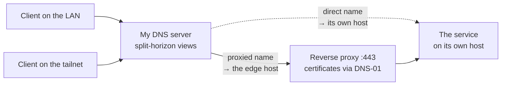

`ssh mars` works. Not `ssh arthur@192.168.15.23`, not a block I hand-wrote in
`~/.ssh/config` three laptops ago — just the name. It works from the sofa and it works from a
hotel, and I do not have to remember which of those I am doing.

`books.mydomain.com` opens in a browser with a valid TLS certificate. That service has never been
reachable from the internet and never will be. It still has a real certificate, from a real CA,
with no warning page.

Adding a machine to all of this is one entry in one file.

That is the setup this post is about. It runs on a small board in a corner of my apartment, and the
board is the least interesting part.

## What it replaces

Before, I had the thing everyone has. IP addresses in `~/.ssh/config`, drifting out of date every
time the router reshuffled a lease. A couple of `/etc/hosts` files edited on the machines where I
had bothered. Self-signed certificates, which means either clicking through a warning several times
a day or teaching five machines to trust a private CA. And a separate mental model for "am I at
home or not", because half of it only worked on the LAN.

Every one of those is a small tax, and none of them is worth a weekend on its own. Together they
are the reason I never quite trusted my own network.

## The inventory is the only thing I edit

There is one data file describing every machine I own. Per host: its name, its LAN address, its
VPN address, what roles it plays, and which services it exposes.

Nothing else is written by hand. From that one file, a template run generates:

- **DNS records** for every host and every service name
- **The reverse proxy configuration**, including which internal port each name maps to
- **SSH config blocks**, so `ssh <name>` resolves for every machine including the ones I do not
  manage
- **The architecture diagrams**, which is how I know the diagrams are never stale

That last one sounds like a flourish and is not. A diagram maintained by hand is a diagram that
lies within a month. If it is generated from the same data that generates the DNS, it is either
correct or the whole apply failed.

Adding a machine means adding its stanza and applying. The name resolves, SSH knows it, the diagram
grows a node.

## Real certificates for names that never face the internet

This is the part most people do not know is possible, and it is the piece that makes the whole
setup pleasant rather than merely tidy.

The usual way to get a certificate is to prove you control a domain by serving a challenge file
over HTTP — which requires the thing to be reachable from the public internet. Internal services
are not, so people fall back to self-signed certificates and the warnings that come with them.

**The DNS-01 challenge proves the same thing by writing a TXT record instead.** Your DNS provider's
API is the proof. Nothing has to be reachable. So a name that only ever resolves inside my house
gets a publicly trusted certificate, automatically renewed, and every browser and every `curl` on
every machine I own is simply happy.

My reverse proxy holds the API token for the DNS provider and does the whole dance itself.

```txt title="Caddyfile"
books.mydomain.com {
    reverse_proxy 127.0.0.1:8083
}
```

That is the entire configuration for one service. TLS is not mentioned because there is nothing to
mention — the proxy sees the name, gets a certificate for it, and keeps it renewed.

**The gotcha that cost me an evening:** the released binary of my proxy does not include the DNS
provider plugin for my registrar. DNS-01 needs it, and there is no configuration flag that will
conjure it. You have to build the binary yourself with that module compiled in. Nothing about the
error message tells you this.

## The same name, wherever you are

Two networks, one namespace. My own DNS server runs split-horizon views: a client on the LAN asking
for a name gets the LAN address; a client on the tailnet asking for the same name gets the Tailscale address.



The effect is that I stopped having a mental model. There is no "the home version of this address".
There is one name, and it is correct from wherever I am asking.

**Tailscale is what makes the away case trivial**, and it deserves the credit. Every machine I own
is on the tailnet, so "works from a hotel" required no port forwarding, no VPN server to run, and no
thinking. It is the single highest-leverage thing in this entire setup, and it is the part I did the
least work for.

## Why not just Tailscale, then?

Fair question — Tailscale ships MagicDNS, which already gives every machine a name. For a while that
was all I used.

Three things pushed me to put my own naming layer on top of it:

**MagicDNS names hosts; I wanted to name services.** A tailnet name gets you to a machine. It does
not give you `books.mydomain.com` pointing at one container among a dozen on that machine, on a
sensible port, over TLS.

**The names live in someone else's namespace.** `machine.tailnet.ts.net` is a fine name and it is not
mine. Under my own domain, the names are portable: if I stopped using Tailscale tomorrow, every
address in my notes, my bookmarks and my SSH config would still be correct, and only the thing
resolving them would change.

**Not everything can join a tailnet.** A Kindle, a handheld console, a smart plug, a games machine
someone else in the house is using — those devices are on the LAN and will never run a Tailscale
client. Split-horizon DNS serves them the same names as everything else. MagicDNS cannot, because
they are not on the tailnet to ask it.

So the two are complementary, and the division is clean: **Tailscale solves reachability, and my
DNS and proxy solve naming and TLS.** Tailscale does the genuinely hard part. I would not try to
replace it, and this setup would be much less pleasant without it.

## The one design rule worth stealing

Every service entry either declares a port or does not, and that single distinction decides how its
name resolves:

**Declares a port** → the name resolves to whichever host runs the reverse proxy, and the proxy
forwards to that port, on itself or across the LAN to another machine. You get TLS, one entry point,
and a name that is independent of which machine actually runs the thing.

**Declares no port** → the name resolves to the service's own host, and clients connect straight to
it. This is for things that are not HTTP and would gain nothing from a proxy — a game server, a file
share.

Two consequences worth stating plainly:

**A proxied name must point at the proxy, not at the service.** This sounds obvious and is the
mistake I made. If a name resolves to the machine running the service instead of the machine running
the proxy, every client arrives at a host with nothing listening on 443. The rule has to be encoded
in whatever generates the DNS, not remembered.

**Moving a service between machines changes nothing that clients can see.** The name still points at
the proxy; only the proxy's forwarding target changed. That property is the actual payoff of
routing everything through one entry point, and it is why I now move services around casually.

## Getting in from outside

Most of these names are deliberately unreachable from the internet. A handful are not, and there are
two mechanisms for that.

A **tunnel** handles the endpoints marked public: an outbound connection from my network to the
provider's edge, so nothing needs a port forwarded and my home address is never a target. And
**dynamic DNS** keeps a record current for my home address, since a residential connection does not
promise to keep one.

One nuance that bit me, and it is a security-shaped one: a tunnel ingress goes **straight to the
port**, bypassing the reverse proxy. Any authentication I had configured in the proxy is therefore
not in the path. For the one endpoint that needs a token checked, the tunnel has to be pointed back
at the proxy rather than at the service — otherwise the guard exists in a config file and not in
reality, which is the worst possible state for an auth check.

## The box

It is an Orange Pi Zero 3: four cores, 4 GB of RAM, arm64, a board small enough to lose behind a
router. It runs the DNS, the proxy, the tunnel, and a stack of containers, and it is not
short of headroom.

A few hardware verdicts, since a board this cheap has sharp edges and I measured these once so I
would never re-derive them:

- **Do not run it from the microSD card.** Root on an SSD, only `/boot` on the card. And do not move
  `/boot` to the SSD while the bootloader still reads the card — apt writes one copy, the bootloader
  loads the other, and every kernel upgrade silently keeps running the old one.
- **Verify a new card holds what it claims.** My first one announced 117 GiB and had 15. It does not
  report an I/O error when you exceed the real capacity; you get filesystem corruption instead, and
  you will debug everything except the card.
- **This board's USB ports are USB 2.0, and that is the ceiling.** Not the enclosure, whatever its
  listing claims. Moving the same enclosure to a USB 3 host made every deficit disappear, so
  replacing the enclosure buys nothing.
- **The USB bridge lied about the drive's write cache**, reporting it disabled while the drive had it
  enabled — so the kernel skipped the flushes the filesystem asked for. That costs the journal's
  ordering guarantee, not just the last few writes. Turning the cache off on the drive itself was the
  fix; going through the bridge is a silent no-op.

Any board with a real disk interface avoids that entire category. But none of it is why the setup
works, and none of it is the interesting part.

## What it costs

**It is one box, and it is both the DNS and the edge.** If it is down, name resolution in the house
is down — which is a worse failure than a service being down, because everything looks broken at
once.

**The fallback taught me something about redundancy.** The board is dual-homed, wired preferred,
wifi as backup. Unplug the cable and it still reaches out perfectly well over wifi — but every DNS
record points at its *wired* address, so nothing in the house can reach *it*. Redundancy that only
works outbound is not redundancy. If a machine is what others depend on, its fallback has to be
reachable at the address they were told to use.

**Certificates depend on my DNS provider's API.** DNS-01 is the mechanism that makes the good part
possible, and it means an outage or a token rotation at that provider is a certificate renewal
problem. Worth knowing before building on it.

---

If you own two computers, this is not worth doing. Around four or five, the small taxes start
compounding: the stale `ssh` config, the certificate warning you click daily, the address you look
up again because you cannot remember it.

The thing that made it worth building was not any single piece. It was deciding that the machines
would be **described** somewhere, once, and that DNS, TLS, SSH and the proxy would all be
consequences of that description rather than four places to keep in sync. The board can die and I
lose an afternoon. The description is the system.
