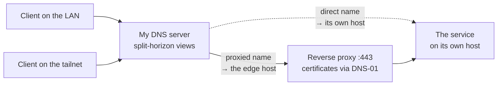

`ssh mars` works. Not `ssh arthur@192.168.15.23`, and not a block I hand-wrote in `~/.ssh/config`
three laptops ago, just the name. It works from the sofa and it works from a hotel, and I don't have
to remember which one I'm doing.

`books.mydomain.com` opens in a browser with a valid TLS certificate. That service has never been
reachable from the internet and never will be. It still has a real certificate from a real CA, with
no warning page.

Adding a machine to all of this is one entry in one file. It all runs on a small board in a corner
of my apartment.

## What it replaces

Before, I had the thing everyone has. IP addresses in `~/.ssh/config`, drifting out of date every
time the router reshuffled a lease. A couple of `/etc/hosts` files edited on the machines where I'd
bothered. Self-signed certificates, which means either clicking through a warning several times a
day or teaching five machines to trust a private CA. And a separate mental model for "am I at home
or not", because half of it only worked on the LAN.

Every one of those is a small tax and none of them is worth a weekend on its own, but together they
were why I never quite trusted my own network.

## The inventory is the only thing I edit

There is one data file describing every machine I own. Per host: its name, its LAN address, its VPN
address, what roles it plays, and which services it exposes.

Nothing else is written by hand. From that one file, a template run generates:

- DNS records for every host and every service name.
- The reverse proxy configuration, including which internal port each name maps to.
- SSH config blocks, so `ssh <name>` resolves for every machine, including the ones I don't
  otherwise manage, which are in the inventory purely so they get a name and an SSH entry.

One host's entry, trimmed:

```yaml title=".chezmoidata/hosts.yaml"
mars:
  roles: [podman, dev, gaming, samba]
  os: linux
  ip:
    lan: 192.168.1.23
    tailscale: 100.64.0.23

  endpoints:
    # Has a port, so it gets a proxy block and a certificate
    - {name: sunshine, port: 47990, scheme: https}

    # No port: SMB is not HTTP, so there is no proxy.
    # Reached directly at files.mydomain.com:445
    - {name: files, probe_port: 445}
```

That's the whole input. How it becomes four different configuration formats, how the file is
validated before anything is applied, and how secrets get in without living in the repository is a
longer post than this one.

What makes it worth the setup is that there is nowhere to forget. Those are three different systems,
in three different config formats, that all have to agree about what a machine is called and where
it lives. Kept by hand they agree until the first time you're in a hurry. Generated from one file
they can't disagree at all.

Adding a machine means adding its stanza and applying. The name resolves and SSH knows it.

## Real certificates for names that never face the internet

This is the part most people don't know is possible, and it's what makes the setup pleasant to use.

The usual way to get a certificate is to prove you control a domain by serving a challenge file over
HTTP, which requires the thing to be reachable from the public internet. Internal services aren't,
so people fall back to self-signed certificates and the warnings that come with them.

The DNS-01 challenge proves the same thing by writing a TXT record. Your DNS provider's API is the
proof, so nothing has to be reachable. A name that only ever resolves inside my house gets a
publicly trusted certificate, automatically renewed, and every browser and every `curl` on every
machine I own is happy with it.

My reverse proxy holds the API token for the DNS provider and does the whole dance itself.

```txt title="Caddyfile"
books.mydomain.com {
    reverse_proxy 127.0.0.1:8083
}
```

That's the entire configuration for one service. TLS isn't mentioned because there's nothing to
mention. The proxy sees the name, gets a certificate for it and keeps it renewed.

The gotcha that cost me an evening: the released binary of my proxy doesn't include the DNS provider
plugin for my registrar. DNS-01 needs it and no configuration flag will conjure it, you have to
build the binary yourself with that module compiled in. Nothing about the error message tells you
this.

## The same name, wherever you are

Two networks, one namespace. My own DNS server runs split-horizon views: a client on the LAN asking
for a name gets the LAN address, and a client on the tailnet asking for the same name gets the
Tailscale address.



So I stopped having a mental model. There's no "the home version of this address", there's one name
and it's correct from wherever I'm asking.

Tailscale is what makes the away case trivial. Every machine I own is on the tailnet, so "works from
a hotel" required no port forwarding, no VPN server to run and no thinking. It's the highest-leverage
thing in the whole setup and it's the part I did the least work for.

## Why not just Tailscale, then?

Fair question, since Tailscale ships MagicDNS, which already gives every machine a name. For a while
that was all I used. Three things pushed me to put my own naming layer on top of it.

MagicDNS names hosts and I wanted to name services. A tailnet name gets you to a machine. It doesn't
give you `books.mydomain.com` pointing at one container among a dozen on that machine, on a sensible
port, over TLS.

The names live in someone else's namespace. `machine.tailnet.ts.net` is a fine name and it isn't
mine. Under my own domain the names are portable, so if I stopped using Tailscale tomorrow every
address in my notes, my bookmarks and my SSH config would still be correct and only the thing
resolving them would change.

And not everything can join a tailnet. A Kindle, a handheld console, a smart plug, a games machine
someone else in the house is using, those are on the LAN and will never run a Tailscale client.
Split-horizon DNS serves them the same names as everything else. MagicDNS can't, because they aren't
on the tailnet to ask it.

So the two are complementary. Tailscale solves reachability, my DNS and proxy solve naming and TLS,
and Tailscale does the genuinely hard part. I wouldn't try to replace it and this setup would be
much less pleasant without it.

## Port or no port

Every service entry either declares a port or doesn't, and that single distinction decides how its
name resolves.

With a port, the name resolves to whichever host runs the reverse proxy, and the proxy forwards to
that port, on itself or across the LAN to another machine. You get TLS, one entry point, and a name
that's independent of which machine actually runs the thing.

With no port, the name resolves to the service's own host and clients connect straight to it. That's
for things that aren't HTTP and would gain nothing from a proxy, like a game server or a file share.

Two consequences. The first is that a proxied name has to point at the proxy and not at the service.
It sounds obvious and it's the mistake I made. If a name resolves to the machine running the service
instead of the machine running the proxy, every client arrives at a host with nothing listening on
443. The rule has to be encoded in whatever generates the DNS, not remembered.

The second is that moving a service between machines changes nothing clients can see. The name still
points at the proxy, only the proxy's forwarding target changed. That's why I now move services
around casually.

## Getting in from outside

Most of these names are deliberately unreachable from the internet. A handful aren't, and there are
two mechanisms for that. A tunnel handles the endpoints marked public: an outbound connection from
my network to the provider's edge, so nothing needs a port forwarded and my home address is never a
target. And dynamic DNS keeps a record current for my home address, since a residential connection
doesn't promise to keep one.

One nuance bit me, and it's a security-shaped one. A tunnel ingress goes straight to the port,
bypassing the reverse proxy, so any authentication I had configured in the proxy isn't in the path.
For the one endpoint that needs a token checked, the tunnel has to be pointed back at the proxy and
not at the service. Otherwise the guard exists in a config file and not in reality, and it looks
configured while being open.

## The box

It's an Orange Pi Zero 3: four cores, 4 GB of RAM, arm64, a board small enough to lose behind a
router. It runs the DNS, the proxy, the tunnel and a stack of containers, and it isn't short of
headroom.

A few hardware verdicts, since a board this cheap has sharp edges and I measured these once so I'd
never have to work them out again:

- Don't run it from the microSD card. Root on an SSD, only `/boot` on the card. And don't move
  `/boot` to the SSD while the bootloader still reads the card, because apt writes one copy, the
  bootloader loads the other, and every kernel upgrade silently keeps running the old one.
- Verify a new card holds what it claims. My first one announced 117 GiB and had 15. It doesn't
  report an I/O error when you exceed the real capacity, you get filesystem corruption instead, and
  you'll debug everything except the card.
- This board's USB ports are USB 2.0 and that's the ceiling, not the enclosure, whatever its listing
  claims. Moving the same enclosure to a USB 3 host made every deficit disappear, so replacing the
  enclosure buys nothing.
- The USB bridge lied about the drive's write cache, reporting it disabled while the drive had it
  enabled, so the kernel skipped the flushes the filesystem asked for. That costs the journal's
  ordering guarantee, not just the last few writes. Turning the cache off on the drive itself was the
  fix, since going through the bridge is a silent no-op.

Any board with a real disk interface avoids that whole category.

## What it costs

It's one box and it's both the DNS and the edge. If it dies, everything on it dies together: the
containers, the reverse proxy, the tunnel. That's the real cost of consolidating and I accept it,
because the alternative is two boxes to maintain.

But do put a public resolver as the secondary on your router. Mine points at `1.1.1.1`. It's one
setting and it changes the shape of the failure completely. Without it, my DNS going down takes the
whole house off the internet, which is the kind of outage someone else in the flat notices
immediately. With it, the internal names stop resolving and everything else carries on. The services
are unreachable either way, since they're on the box that died, so losing their names costs nothing
extra.

Worth knowing that failover between resolvers isn't instant or uniform across clients, some will sit
through a timeout first. It degrades rather than switching cleanly, which is still a much better
failure than going dark.

The fallback taught me something about redundancy. The board is dual-homed, wired preferred and wifi
as backup. Unplug the cable and it still reaches out perfectly well over wifi, but every DNS record
points at its wired address, so nothing in the house can reach it. Redundancy that only works
outbound isn't redundancy. If a machine is what others depend on, its fallback has to be reachable at
the address they were told to use.

Certificates depend on my DNS provider's API. DNS-01 is the mechanism that makes the good part
possible, and it means an outage or a token rotation at that provider is a certificate renewal
problem. Worth knowing before building on it.

---

If you own two computers this isn't worth doing. Around four or five the small taxes start
compounding: the stale `ssh` config, the certificate warning you click daily, the address you look up
again because you can't remember it. What made it worth building was deciding that the machines
would be described somewhere once, and that DNS, TLS, SSH and the proxy would all be generated from
that description instead of being four places to keep in sync.
